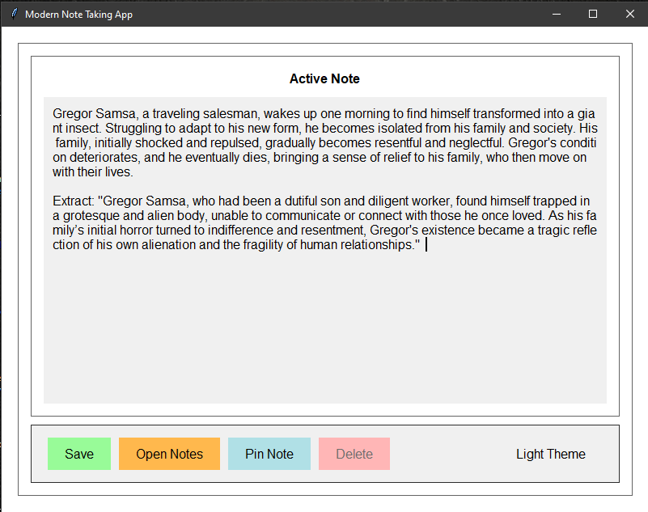
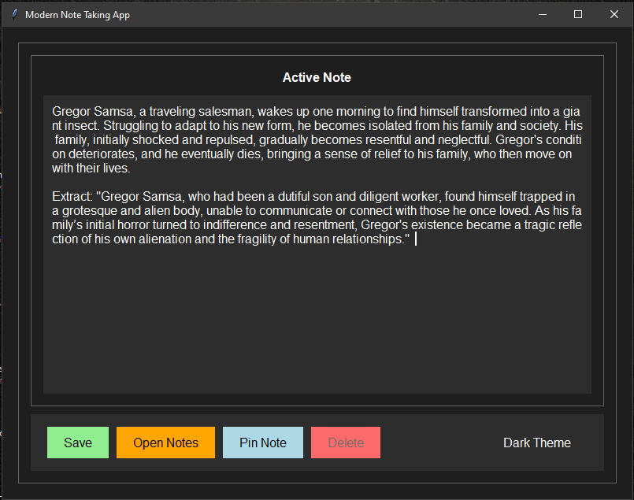
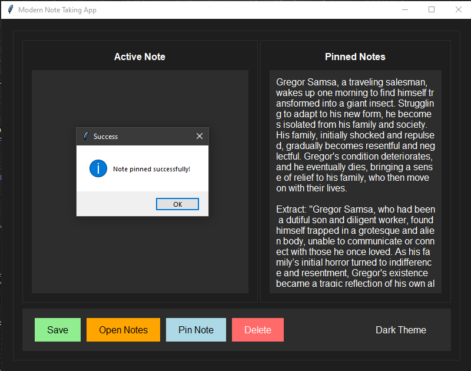
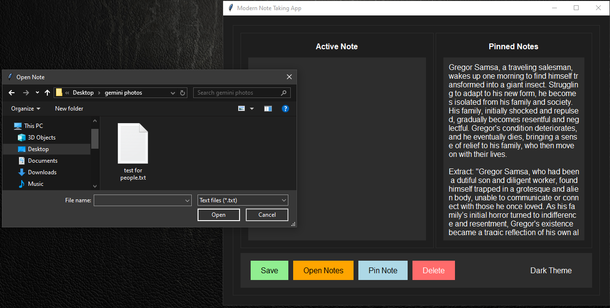
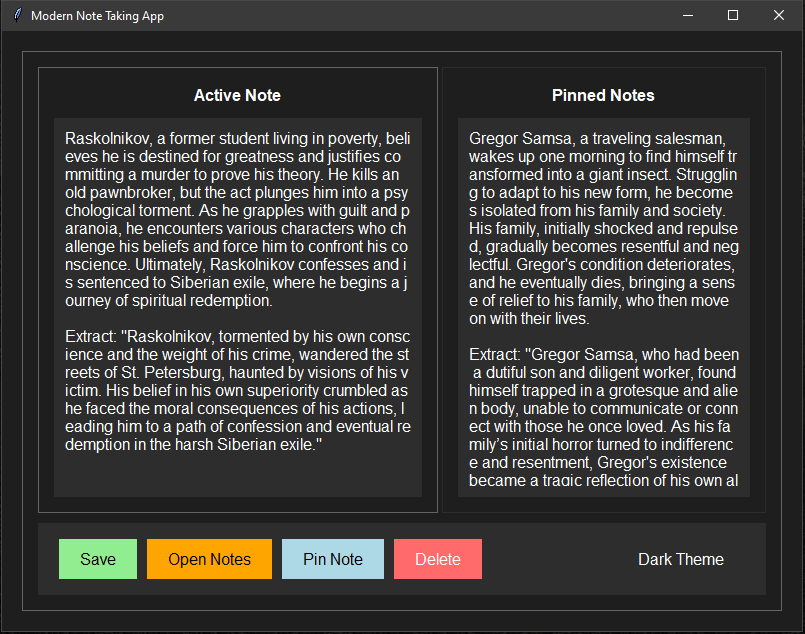
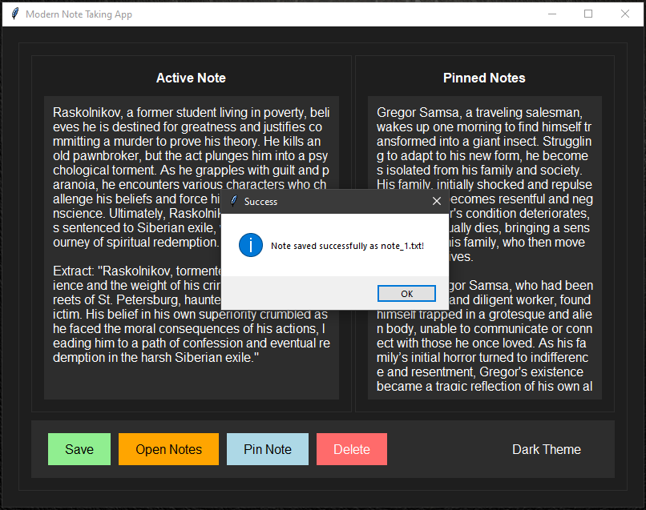
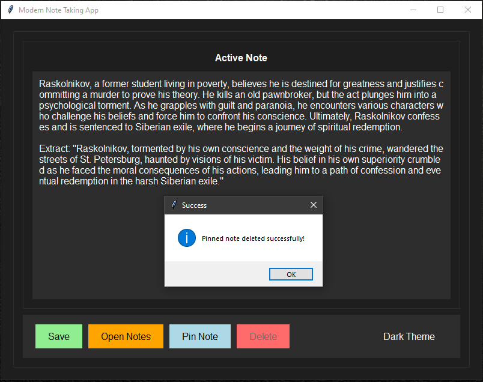
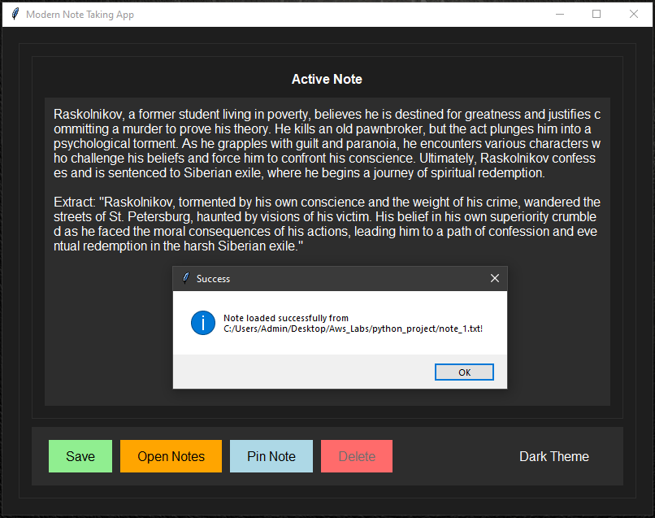

# Modern Note Taking App

A sleek and modern note-taking application built with Python and Tkinter, featuring a customizable dark/light theme and intuitive user interface.

## Features

- 📝 Clean and modern user interface
- 🌓 Dark and light theme support
- 📌 Pin important notes
- 💾 Save and load notes
- 🎨 Custom styling with Dosis font
- ↔️ Split-pane interface for active and pinned notes
- 🎯 Responsive design with Sharp corners

## Technologies Used

- Python 3.x
- Tkinter (GUI Framework)
- ttk (Themed Widgets)
- Pathlib (File Operations)

## Requirements
## No external dependencies required beyond Python standard library
- Make sure you have at least python 3.12 or above

## Installation & Usage

1. Clone the repository:
- git clone https://github.com/Supershivam5/Python_Script_Project.git
- cd Python_Script_Project ( Use git bash )

3. Run the application:
- python app.py

## User Interface Screenshots

## User Interface Components

### Main Window
- Nostalgic frame with sharp corners
- Split-pane layout for active and pinned notes
- Custom-styled buttons and text areas

### Buttons
- 💾 Save - Save current note to file
- 📂 Open Notes - Load existing notes
- 📌 Pin Note - Pin important notes for quick reference
- 🗑️ Delete - Remove pinned notes
- 🌓 Theme Toggle - Switch between dark and light themes

### Text Areas
- Active Note section for current note editing
- Pinned Notes section for important references
- Custom styling with modern colors and fonts

## Features in Detail

### Theme Customization
- Dark theme with modern dark colors (#1e1e1e, #2d2d2d)
- Light theme with comfortable reading colors
- Automatic UI updates when switching themes

### Note Management
- Auto-incrementing note files (note_1.txt, note_2.txt, etc.)
- UTF-8 encoding support for international characters
- Error handling for file operations
- Warning messages for empty notes

### UI/UX Features
- Hover effects on buttons
- Disabled state handling
- Responsive layout
- Clear visual feedback for actions

## Contributing

Feel free to fork this repository and submit pull requests for any improvements.

## License

This project is open source and available under the [MIT License](LICENSE).

## Author
**Shivam Bendre**

